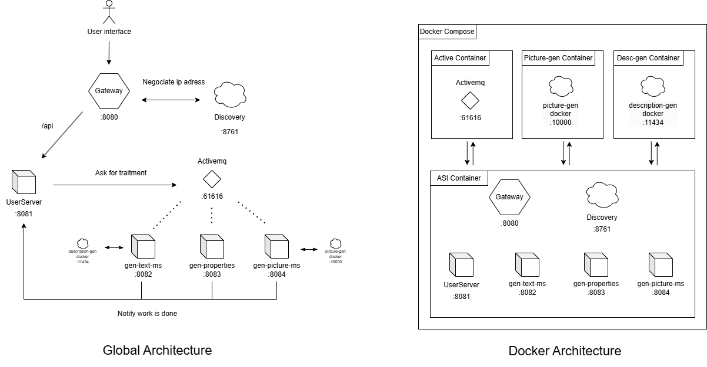
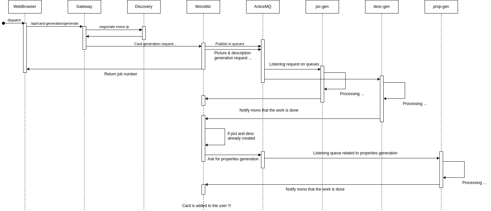

# ASI-CSBM


# Back

## Diagramme d'architecture


*Remarques: Tous nos microservices sont en Springboot*


### 1.1

## Diagramme de séquence 


## Démarrer le back

````bash
cd back
# Modifier la ligne suivante : external.iaimgapi.token=yourtoken avec votre token
docker compose up -d
curl http://localhost:11434/api/pull -d '{"name": "qwen2:0.5b"}'
````

Quelques API:
- /api/card-generation/generate
- /api/job
- /api/users
- ...

### 1.2 Réaliser un tableau récapitulatif des bus de communication les plus répandus (avantages/inconvénients) :

| **ESB** | **Avantages**                                                                                                                                                   | **Inconvénients** |
| --- |---| --- |
| **Apache Camel** | - Open source et gratuit.<br/>- Supporte de nombreux protocoles et formats de données.<br/>- Flexible et léger. | - Courbe d’apprentissage élevée.<br/>- Nécessite des efforts pour le monitoring et la gestion. |
| **MuleSoft (Anypoint)** | - Grande facilité d'intégration avec de multiples systèmes.<br/> - Interface conviviale avec des outils graphiques.<br/>- Documentation et support commercial de qualité. | - Coût élevé des licences.<br/>- Nécessite des compétences spécifiques en MuleSoft. |
| **WSO2 ESB** | - Open source avec une bonne documentation.<br/>  - Supporte les API et les microservices. <br/> - Extensible avec d'autres produits WSO2.                                | - Complexe à configurer.<br/> - Besoin d’efforts supplémentaires pour assurer le scaling. |
| **Red Hat Fuse** | - Basé sur Apache Camel, offrant une grande flexibilité. <br/> - Bien adapté pour des architectures distribuées. <br/> - Intégré dans l’écosystème Red Hat.               | - Peut être difficile à maîtriser.<br/>- Nécessite souvent une expertise sur Red Hat et Kubernetes. |
| **IBM App Connect** | - Haute performance et stabilité.<br/>  - Prise en charge des intégrations complexes.<br/> - Fonctionnalités avancées pour les entreprises.                               | - Coût très élevé. <br/> - Configuration complexe. |
| **TIBCO BusinessWorks** | - Solution mature et éprouvée pour les grandes entreprises. <br/> - Très bon support pour l'intégration cloud et hybride.                                            | - Coût des licences élevé. <br/> - Moins adapté aux petites structures ou projets simples. |
| **Dell Boomi** | - Solution iPaaS (Integration Platform as a Service), facile à utiliser. <br/> - Automatisation avancée et gestion des flux de travail.                              | - Limitation des fonctionnalités avec les abonnements de base. <br/> - Peut devenir coûteux à grande échelle. |

### 2.1 Réaliser un tableau comparatif des principaux Framework FrontEnd existants dressant les avantages et inconvénients de chacun :

| **Framework** | **Avantages** | **Inconvénients** | **Cas d’utilisation** |
| --- | --- | --- | --- |
| **React** (Meta) | - Très populaire avec une large communauté  - Architecture modulaire basée sur des **composants** <br/> - Flexibilité avec une gestion fine de l'état (**Redux, Context API**) <br/> - Ecosystème riche et de nombreux plugins | - Courbe d’apprentissage parfois difficile avec les hooks et outils connexes <br/> - Nécessite des bibliothèques externes pour des fonctionnalités avancées (ex: routing)  <br/>- Code plus complexe avec les grandes applications | - Applications web complexes et dynamiques  <br/>- Applications SPA (Single-Page Applications)  <br/>- Solutions omnicanales avec React Native |
| **Angular** (Google) | - **Framework complet** avec routing, gestion d’état, et outils intégrés <br/> - **TypeScript** intégré, facilitant la maintenance <br/> - Support natif du **two-way data binding** (liaison bidirectionnelle) <br/> - Bien adapté aux grandes équipes et projets d’entreprise | - Très complexe avec une courbe d’apprentissage élevée <br/> - Performance moindre pour de petites applications <br/> - Beaucoup de configuration nécessaire | - Applications d’entreprise et grandes plateformes <br/> - Projets nécessitant une grande structure et modularité  <br/>- Applications nécessitant un support officiel long terme |
| **Vue.js** | - Simple à apprendre, documentation claire  <br/>- Equilibre entre simplicité et flexibilité  <br/>- Possibilité de développement progressif (adoption modulaire)  <br/>- Très rapide et performant | - Moins de ressources/emplois disponibles par rapport à React  <br/>- Ecosystème plus petit, avec une communauté moindre  <br/>- Difficulté de montée en échelle dans de très grandes applications | - Petites à moyennes applications  <br/>- Projets nécessitant une montée en puissance progressive  <br/>- Solutions de prototypage rapide |
| **Svelte** | - Sans virtual DOM : performances très rapides  <br/>- Code plus simple et plus lisible, car le CSS, HTML et JS sont intégrés  <br/>- Compile le code au moment du **build**, réduisant le poids au runtime | - Communauté et écosystème limités  <br/>- Moins d’outils et d’extensions que les autres frameworks  <br/>- Support d’entreprise moins répandu | - Petites applications ou prototypes  <br/>- Interfaces légères nécessitant une performance rapide  <br/>- Projets avec des contraintes de taille de bundle |
| **Solid.js** | - Performances très élevées grâce au rendu réactif précis  <br/>- Sans virtual DOM et utilisation efficace de l’état local  <br/>- API proche de React (facilitant la transition) | - Framework encore jeune, moins d’adoption et de support  <br/>- Manque de documentation et d’outils avancés  <br/>- Communauté et ressources limitées | - Projets où les performances sont critiques  <br/>- Applications SPA avec des besoins dynamiques en temps réel  <br/>- Bon choix pour l’innovation et les projets pilotes |